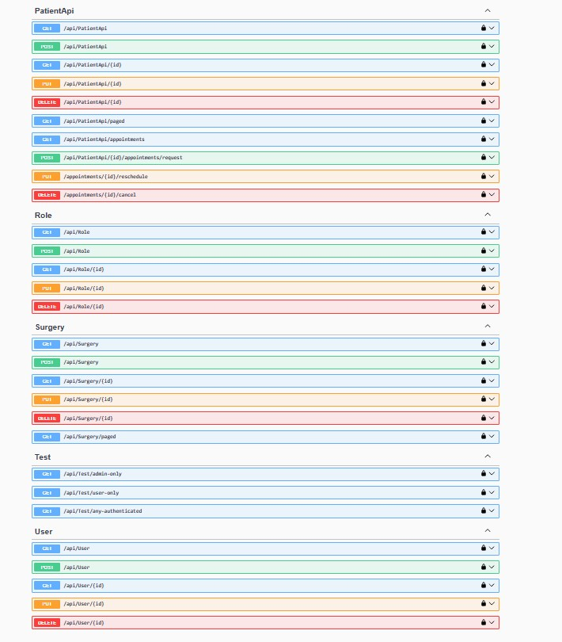

# Dental Surgeries Management System

## Table of Contents

- [Introduction](#introduction)
- [Technologies](#technologies)
- [Project Structure](#project-structure)
- [Database Schema](#database-schema)
- [How to Run](#how-to-run)
- [API Endpoints](#api-endpoints)
- [Authentication & Authorization](#authentication--authorization)
- [Testing](#testing)
- [Screenshots](#screenshots)
- [Author](#author)

---

## Introduction

The **Dental Surgeries Management System** is a full-stack web application designed to manage dental surgeries, patients, dentists, appointments, and related operations.  
It follows **Clean Architecture** with a multi-layered structure and is built using **ASP.NET Core 8**, **Entity Framework Core**, and **SQL Server**, and uses **Docker** for containerized deployment.

---

## Technologies

- ASP.NET Core 8 Web API
- Entity Framework Core
- SQL Server
- Docker & Docker Compose
- AutoMapper
- Swagger
- JWT (JSON Web Token)
- xUnit, Moq, FluentAssertions

---

## Project Structure

- **Domain**: Entity models, Enums
- **Application**: DTOs, Interfaces, Services, Validations
- **Infrastructure**: Implementations for services like JWT and Email
- **Data**: EF Core DbContext, Repository Implementations, Migrations
- **Api**: Controllers, Middleware, Dependency Injection setup

---

## Database Schema

The system handles core entities such as Users, Roles, Surgeries, Dentists, Patients, Addresses, Appointments, and Bills.

Below is the ER diagram that represents the relationships between entities:


---

## How to Run

### Prerequisites

- [.NET 8 SDK](https://dotnet.microsoft.com/en-us/download/dotnet/8.0)
- [Docker Desktop](https://www.docker.com/products/docker-desktop/)
- Visual Studio or Visual Studio Code

### Clone and Build

```bash
git clone https://github.com/Rayentj/Dental-Surgeries-Management-System.git
cd Dental-Surgeries-Management-System/DentalApp
docker-compose up --build
```

- API will be available at: `https://localhost:5001/swagger/index.html`
- SQL Server will be accessible on port `1433`

---

## API Endpoints

Explore all the available API endpoints using Swagger:

👉 `https://localhost:5001/swagger/index.html`

| Category    | Sample Endpoint               |
|-------------|-------------------------------|
| Address     | `/api/Address`                |
| Appointment | `/api/Appointment`            |
| Auth        | `/api/Auth/login`             |
| Bill        | `/api/Bill`                   |
| Dentist     | `/api/Dentist`                |
| Patient     | `/api/PatientApi`             |
| Role        | `/api/Role`                   |
| Surgery     | `/api/Surgery`                |
| User        | `/api/User`                   |

---

## Authentication & Authorization

- JWT token-based authentication
- Role-based authorization (`Admin`, `Dentist`, `Patient`)
- Protected endpoints marked with the 🔒 lock symbol in Swagger

---

## Testing

The project supports:

- **Unit Testing** with xUnit, Moq, FluentAssertions
- **Integration Testing** using WebApplicationFactory and TestServer

```bash
dotnet test
```

---

## Screenshots


### Swagger UI - API Part 1


### Swagger UI - API Part 2



---

## Author

**Rayen Tajouri**  
📧 [GitHub Profile](https://github.com/Rayentj)

